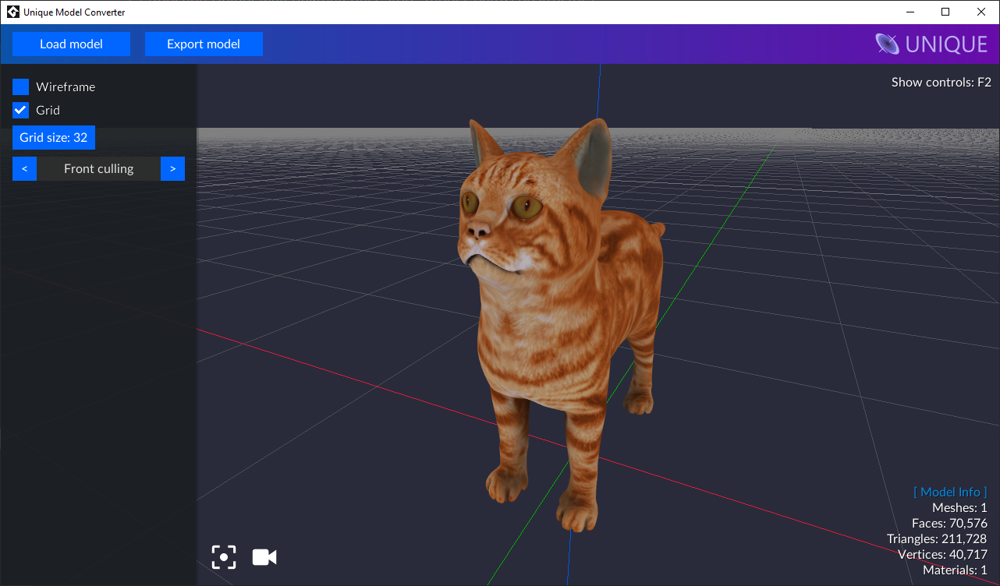

# Unique - 3D Model Converter Tool for Game Maker Studio 2



This tool allows to preview a 3D model directly rendered with GameMaker Studio 2 and to export it to an optimized buffer container ready to be quickly loaded into your game, even for heavy models.

**Example to load a model, once exported with this tool:**

```js
// Create event
model = ue_model_load("cat.unique");

// Draw event
model.draw()
```

## Download

Once finished, the tool will be available on the [releases](https://github.com/unique-engine/model-converter/releases) page as Windows executable, for now please download the repo and open the project with GMS.

The GameMaker Studio 2 library to load the models is [available here](https://github.com/unique-engine/gms-lib).

---

## Credits

- User Interface - Developed with [Headless UI](https://github.com/headlessuigm/headlessui).
- Models Importer - GM Assimp (a porting of the [Open Assimp Import Library](https://github.com/assimp/assimp), made by [Jak](https://www.gmitalia.altervista.org/forum/memberlist.php?mode=viewprofile&u=868)).
